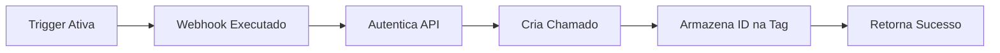
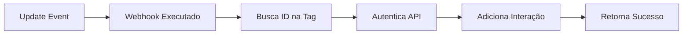

# Zabbix Desk Manager Integration

[](https://www.zabbix.com/)
[](https://desk.ms/)
[](LICENSE) 

Integração completa entre Zabbix e Desk Manager através de webhooks, permitindo a abertura automática de chamados e adição de interações baseadas em eventos do Zabbix.

## 📁 Estrutura do Repositório

```
Desk-Manager-integration-via-Zabbix-media-type/
│
├── desk_manager_media_type.yaml      # Media Type do Zabbix (importar)
├── consultas_api_desk_manager.py     # Script Python para listar usuários
├── .env                              # Variáveis de ambiente
├── README.md                         # Esta documentação
└── LICENSE                           # Licença GPL-3.0
```

## 🚀 Características

- ✅ **Abertura automática de chamados** quando um novo problema é detectado
- ✅ **Adição de interações** quando eventos são atualizados (acknowledge, comentários)
- ✅ **Mapeamento inteligente de severidade** para impacto e urgência
- ✅ **Sem duplicação de chamados em atualizações de eventos** - usa tags de evento para rastreamento
- ✅ **Link direto para o evento** no Zabbix dentro do chamado

## 📦 Pré-requisitos

- **Zabbix**: Versão 7.4 ou superior
- **Desk Manager**: Conta ativa com acesso à API
- **Credenciais**:
  - Chave Operador (Authorization)
  - Chave Ambiente (PublicKey)

## 🔧 Instalação

### 1. Importar Media Type

1. Acesse: **Alerts → Media types**
2. Clique em **Import**
3. Selecione o arquivo `desk_manager_media_type.yaml`
4. Marque a opção **Update existing**
5. Clique em **Import**

### 2. Configurar Parâmetros

Edite o Media Type importado e configure os seguintes parâmetros obrigatórios:

| Parâmetro | Descrição | Exemplo |
|-----------|-----------|---------|
| `api_url` | URL base da API | `https://api.desk.ms` |
| `chave_operador` | Chave operador do usuário | `d4987bc6f32c2c66baac5489e01d6019206156b1` |
| `chave_ambiente` | Chave ambiente do usuário | `0d949eabcec480198ca545d1714f904wf1984d56` |
| `solicitante` | Código do solicitante | `98` |
| `email_solicitante` | Email do solicitante | `suporte@empresa.com.br` |
| `solicitacao` | Código da solicitação | `000071` |
| `tipo_ocorrencia` | Código tipo ocorrência | `000008` |
| `auto_categoria` | Código da autocategoria | `9481` |
| `cod_grupo` | Código do grupo | `000010` |

### 3. Criar Usuário no Zabbix

1. Acesse: **Users → Users**
2. Crie um novo usuário (ex: `DeskManager`)
3. Aba **Media**: Adicione o media type **Desk Manager**
4. **Send to**: Configure JSON de mapeamento dos usuários e seus respectivos IDs   
   
   ```json
   { "joao.jose": 260, "maria.marluce": 261, "pedro.pascal": 262, "ana.costa": 263}
   ```
   
> [!NOTE]
> Quando o nome do operador aparecer na descrição do alerta ou em comentários, o chamado será automaticamente atribuído ao operador correspondente no Desk Manager. Os usuários devem estar como criados e corresponder ao código do operador no Desk Manager.

> [!TIP]
> Para descobrir o código dos operadores, use o script Python incluído.

> [!IMPORTANT]
> Deixe em branco e o chamado será atribuído apenas ao grupo configurado no parâmetro `cod_grupo` e as interações são vinculadas ao usuário dono da chave operador.
5. Ative para todos os períodos de severidade

### 4. Configurar Actions

1. Acesse: **Alerts → Actions → Trigger actions**
2. Crie ou edite uma action
3. Aba **Operations**:
   - **Send to users**: Selecione o usuário criado
   - **Send to media type**: Desk Manager
4. Aba **Update Operations**: Configure para enviar updates também
5. Aba **Recovery Operations**: Pode deixar vazio (não cria chamados na resolução)

## ⚙️ Configuração

### Obter Códigos do Desk Manager

Os códigos necessários podem ser obtidos através da API do Desk Manager. Use o script Python incluído:

1. **Instale as dependências:**
   ```bash
   pip install requests
   ```

2. **Configure suas credenciais:**
   
   O script usa um arquivo `.env` para armazenar as credenciais de forma segura. Crie o arquivo `.env` na raiz do projeto:
   
   ```bash
   # .env
   CHAVE_OPERADOR=sua_chave_operador_aqui
   CHAVE_AMBIENTE=sua_chave_ambiente_aqui
   ```
> [!WARNING]
> Nunca commite o arquivo `.env` no Git! Ele já está incluído no `.gitignore`.

3. **Execute o script:**
   ```bash
   python consultas_api_desk_manager.py
   ```

### Configurar Macro Global

Configure a macro `{$ZABBIX.URL}` em **Administration → Macros**:

```
{$ZABBIX.URL} = http://seu-zabbix.exemplo.com.br
```

## 🔄 Como Funciona

### Fluxo de Abertura de Chamado



1. **Evento Problem**: Trigger é ativada no Zabbix
2. **Webhook**: Media type é executado
3. **Autenticação**: Obtém token da API Desk Manager
4. **Criação**: Abre novo chamado com dados do evento
5. **Tag**: Armazena ID do chamado na tag `__desk_ticket_id`
6. **Resultado**: Retorna sucesso ao Zabbix

### Fluxo de Atualização



1. **Update Event**: Acknowledge ou comentário no evento
2. **Webhook**: Media type é executado
3. **Busca ID**: Recupera ID do chamado da tag
4. **Autenticação**: Obtém token da API
5. **Interação**: Adiciona interação ao chamado existente
6. **Resultado**: Retorna sucesso ao Zabbix

### Fluxo de Resolução

O evento de resolução (Recovery) **não executa ação alguma** por padrão. Se necessário criar interação de fechamento, configure uma Recovery Operation na Action.

## 📊 Mapeamento de Severidade

A severidade do Zabbix é automaticamente mapeada para Impacto e Urgência do Desk Manager:

| Severidade Zabbix | Valor | Impacto | Urgência |
|-------------------|-------|---------|----------|
| 🔴 Disaster | 5 | Alto (3) | Alto (3) |
| 🟠 High | 4 | Médio (2) | Alto (3) |
| 🟡 Average | 3 | Médio (2) | Médio (2) |
| 🔵 Warning | 2 | Médio (2) | Baixo (1) |
| ⚪ Information | 1 | Baixo (1) | Baixo (1) |
| ⚫ Not Classified | 0 | Baixo (1) | Baixo (1) |

> **Nota**: Os códigos (1, 2, 3) podem variar conforme sua instalação do Desk Manager. Ajuste os valores no código se necessário.

## 🐛 Troubleshooting

### Problema: "Authentication failed"

**Causa**: Credenciais inválidas ou incorretas

**Solução**:
- Verifique se a Chave do Operador está correta
- Verifique se a Chave do Ambiente (PublicKey) está correta

### Problema: Chamados duplicados

**Causa**: Tag `__desk_ticket_id` não está sendo salva

**Solução**:
- Verifique se **Process tags** está marcado como **YES** no Media Type

### Problema: "Desk Manager API error: XXXXX"

**Causa**: Erro retornado pela API do Desk Manager

**Solução**:
- Verifique se os códigos (solicitante, solicitação, tipo ocorrência, etc) existem no Desk Manager
- Verifique se a autocategoria está configurada corretamente
- Consulte a documentação da API Desk Manager

### Reportar Bugs

Ao reportar bugs, inclua:
- Versão do Zabbix
- Logs relevantes do Zabbix Server
- Passos para reproduzir o problema
- Comportamento esperado vs obtido

## 📝 Changelog

### [1.0.0] - 2024-11-02

#### Adicionado
- Integração completa com API Desk Manager
- Abertura automática de chamados
- Adição de interações em updates
- Mapeamento de severidade
- Suporte a autocategorização
- Script Python para testes

## 📄 Licença

Este projeto está licenciado sob a Licença GPL-3.0 - veja o arquivo [LICENSE](LICENSE) para detalhes.

## 📞 Suporte

- **Issues**: [GitHub Issues](https://github.com/limaalef/Desk-Manager-integration-via-Zabbix-media-type/issues)

---

⭐ Se este projeto foi útil para você, considere dar uma estrela no GitHub!
